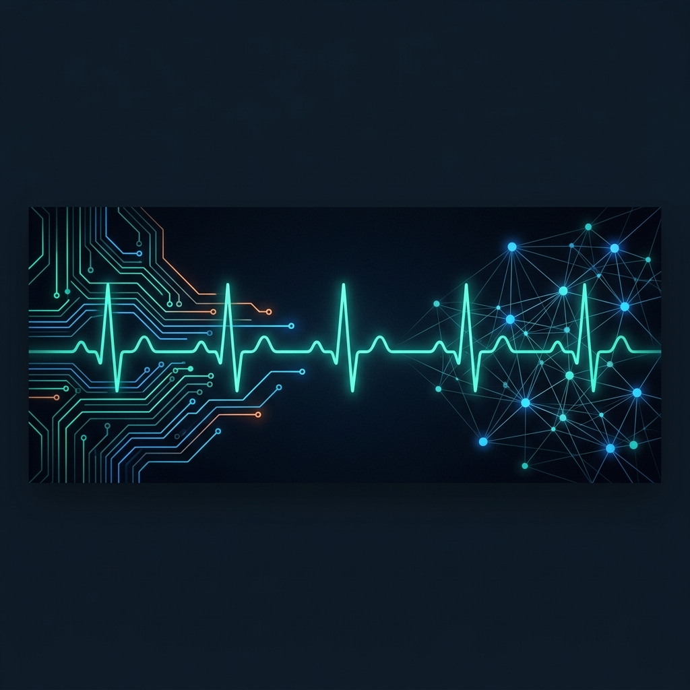

<!-- 
  ┌──────────────────────────────────────────────────────────┐
  │  This README is not a template. It's a datasheet.        │
  └──────────────────────────────────────────────────────────┘
-->

<a href="https://github.com/bipin-vishwakarma">
  
</a>

<br />

<div align="center">

<h1>
  
  BIPIN VISHWAKARMA
</h1>

**Biomedical Engineer — UPES Dehradun '27**
<br />
**Design Head, IEEE Student Chapter**
<br /><br />
Building systems that sit at the edge of **biology**, **electronics**, and **intelligence**.
<br />
From PCB traces to neural networks — if it can be prototyped, I build it.

<br />

<a href="mailto:Bipinvishwakarma145@gmail.com"></a>&nbsp;&nbsp;
<a href="https://www.linkedin.com/in/bipin-vishwakarma-b407313b8"></a>&nbsp;&nbsp;
<a href="https://github.com/bipin-vishwakarma"></a>

</div>

<br />

---

<br />

### 🔬 What I'm Working On

<table>
<tr>
<td width="60%" valign="top">

**Electrochemical Sensing Platform** &nbsp; `🔒 confidential`
<br />
<sub>Neanic Solutions — Research Internship</sub>

Portable electrochemical sensing system for microneedle-based detection.
Self-designed potentiostat. Active R&D under funded research infrastructure.

<sub>No chip names, part numbers, or materials disclosed — active IP.</sub>

</td>
<td width="40%" valign="top">

**Friday** &nbsp; `🟢 active build`
<br />
<sub>Multi-Agent AI Desk Assistant</sub>

Voice + Vision + Web UI.
FastAPI backend, Groq Whisper STT,
Kokoro-82M TTS, MediaPipe presence
detection via phone IP cam.

</td>
</tr>
</table>

<br />

### ⚡ Past Builds

<table>
<tr>
<td valign="top">

**Milk Purity Analyzer**
<br /><sub>IoT · Arduino · Custom Electrodes</sub>
<br /><sub>Real-time adulteration detection + mobile app monitoring</sub>

</td>
<td valign="top">

**Wireless Energy Transmission**
<br /><sub>ZVS · Mutual Induction · Resonant Coupling</sub>
<br /><sub>~10% efficiency gain · Exhibited at SOHST Foundation Day</sub>

</td>
<td valign="top">

**Smart Pill Dispenser**
<br /><sub>ESP32-S3 · KiCad · Fab-ready</sub>
<br /><sub>Full schematic → ERC/DRC → Gerber export</sub>

</td>
<td valign="top">

**Trading Bots**
<br /><sub>MQL5 · MetaTrader</sub>
<br /><sub>Grid & hedge strategies · proprietary lot-sizing</sub>

</td>
</tr>
</table>

<details>
<summary>&nbsp;<b>⚡ Where it all started — Tesla Coils at 14 (NTPC Exhibition, 2020)</b></summary>
<br />
<blockquote>
Designed SSTC & SGTC Tesla Coils, built a Jacob's Ladder, created a Water Bridge,
and burned Lichtenberg fractal art into wood — all exhibited at the NTPC Vindhyachal Exhibition.
<br /><br />
That's where the love for electronics began. From arcing coils to biosensing circuits.
</blockquote>
</details>

<br />

---

<br />

### 🧰 Stack

<div align="center">

| Hardware | AI & Software | Biomedical | Web & Other |
|:---:|:---:|:---:|:---:|
| KiCad | Python | MRI Systems | HTML / CSS / JS |
| ESP32 / S3 | FastAPI | CT & X-Ray | MQL5 |
| Arduino | TensorFlow | Ultrasound | MATLAB |
| PCB Design | MediaPipe | ECG Monitoring | SolidWorks |
| IoT Systems | Streamlit | Electrochemical Sensing | Git / GitHub |
| Analog AFE | AI Agents | Patient Monitoring | VPS / Servers |

</div>

<br />

---

<br />

### 📅 Timeline

```
 2020 ─── ⚡ Built Tesla Coils & high-voltage experiments @ NTPC Exhibition
           │
 2023 ─── 🎓 Started B.Tech Biomedical Engineering @ UPES Dehradun
           ├── 🏆 Won Circuit Craft — IEEE UPES
           └── 🔧 Self-taught KiCad & PCB design
           │
 2024 ─── 🎨 Became Design Head — IEEE Student Chapter
           └── 🏆 3rd in Poster Mania — Avgaahan, University of Delhi
           │
 2025 ─── 💼 Technical Intern — Carrier Wings LLC (VoIP)
           ├── 🥛 Built Milk Purity Analyzer with custom electrodes
           ├── ⚡ Wireless Energy Transmission — SOHST Foundation Day
           └── 🏥 GE Healthcare training — Cath Lab, PET-CT, MRI @ Bangalore
           │
 2026 ─── 🔬 Research Intern — Neanic Solutions (electrochemical sensing)
           └── 🤖 Building Friday — multi-agent AI assistant
           │
 2027 ─── 🎯 Next: Singapore / South Korea — biomedical-AI
```

<br />

<details>
<summary>&nbsp;<b>📜 Certifications</b></summary>
<br />

| Year | Training | Where |
|:---:|:---|:---|
| 2025 | Hands-on: Cath Lab, PET-CT, MRI | GE Healthcare, Bangalore |
| 2025 | Product Development Workshop | IEEE × Einstein Box |
| 2024 | CT & X-Ray Modality | UPES |
| 2024 | Anaesthesia, Ventilator, Monitor & Ultrasound | UPES |

</details>

<br />

---

<br />

### 📊 GitHub

<div align="center">


&nbsp;


</div>

<br />

---

<br />

<div align="center">

<sub>

Started with Tesla Coils at 14.
Now building biosensors and AI agents.

**Prototype first. Validate hard. Ship real systems.**

</sub>

</div>